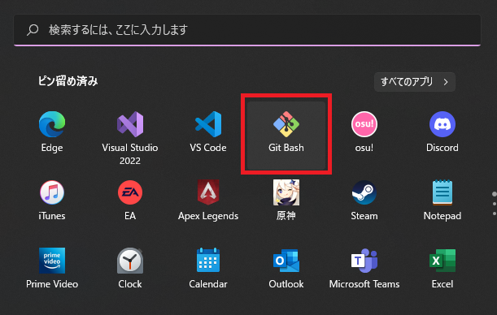

### レポジトリークローンの作り方

今回はONE_DOCUMENTのクローン作製を例にして説明します。

1. git Bash を起動しましょう
   
    <br><br>

 
2. git用のディレクトリーを作りましょう
   
   まず自分の場所を確認するため`pwd`コマンドを実行してみましょう。<br>
   `User`配下の自分のフォルダーにいればOK
   ```bash
   pwd 
   ```

   

   次にディレクトリを作ります。<br>
   `mkdir git`コマンドを実行してみましょう。
   ```bash
   mkdir git
   ```
   これでディレクトリが作成されましたはずなので`ls`コマンドで確認してみましょう。
   ```bash
   ls
   ```
   <br>
   このように`git`フォルダーができていればOKです。<br><br>

3. `git`フォルダーにCloneを作りましょう
   
   gitフォルダーに移動します。以下の`cd`コマンドを実行します。
   ```bash
   cd git
   ```
   
   実行後確認したければ`pwd`コマンドで移動できたか確認できます。
   ```bash
   pwd
   ```

   移動できたことを確認したら早速クローンを作ってみましょう。
   `git Clone [Git Hub CLI]` コマンドを実行します。


   GitHub URL はCloneしたいリポジトリの以下から確認できます。
   今回はONE_DOCUMENTのリポジトリーをCloneしましょう。
   
   ```bash
   git clone https://github.com/ONE-PROJECT-JAPAN/ONE_DOCUMENT.git
   ```
   以下のように`done`していたら成功

   

   Explorerで見るとファイルができている
   
   


[チュートリアルに戻る](../Read_Me.md#チュートリアル)