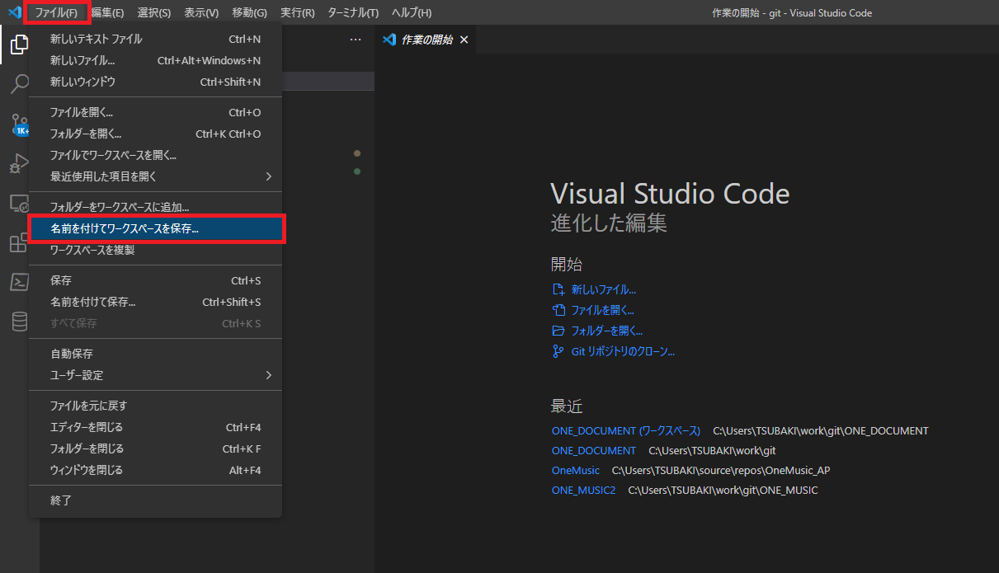
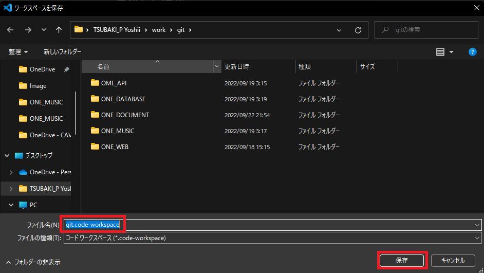

# ソースファイルを編集する(Visual_Studio_Code編
編集する前に編集用のbranchを作って切り替えて置くこと 
[branchを作成する](/Common_Doc/How_To_Make_Branch.md)

## 1 Visual_Studio_Codeを起動する。
Visual_Studio_Codeがインストールされていれば`Windowsキー`をおして

## 2 Gitのフォルダーを開く
1. フォルダーをクリック 
   

2. `git`フォルダーを開く
   

3. フォルダーの信頼確認が出るのでそのまますべて信頼をクリック
   

4. git のフォルダーが以下ように表示されればOK
   
   

## 3 ワークスペースを保存する

1. `ファイル`から`名前をつけてワークスペースを保存`を選択 
   

2. `git`のディレクトリーにデフォルトの名前で保存をする 
   

3. これで次回からワークスペースファイルをクリックすれば 
   そこからすぐに開くことができる。
   もしくは、Visual_Studio_Codeを実行するとデフォルトで開かれる。

   [チュートリアルに戻る](/Read_Me.md#チュートリアル)