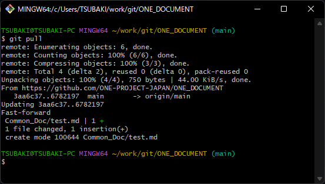
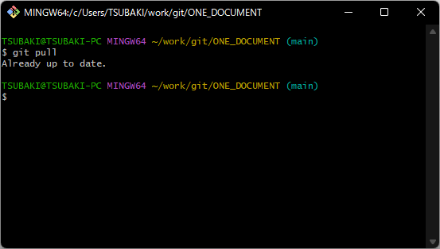

# main branchをpullして最新にする。

1. git Bash を起動しましょう
   
    <br><br>

2. `pull`するリポジトリーへ移動しましょう
userのディレクトリーからであれば以下のコマンドで移動できます。<br>
※今回はONE_DOCUMENTのbranchを作ってみす。<br>

   ```sh
   cd git/ONE_DOCUMENT
   ```
   以下のように`ONE_DOCUMENT`のディレクトリーにいればOK<br>
   ※執筆者の環境では`work/`配下にいるので下記のようになっている。<br>
   併せて`ONE_DOCUMENT`の後ろの`main`にも注目。
   ここには現在いる自分のいる`branch`が表示される。<br>
   `branch`が`main`でない場合は`branch`を移動しましょう。[branchの移動方法](#branchの移動)<br>
   

3. `main branch`を`git pull`しましょう。<br>
   ```sh
   git pull
   ```
   以下のようになれば`pull`成功
   
   <br><br>
   以下の場合はすでに最新になっている。
   

4. チュートリアル終了
   
[チュートリアルに戻る](../Read_Me.md#チュートリアル)
<br><br>

<br>

# branchの移動
1. `main branch`へ移動してみよう<br>
   `git checkout`コマンドで移動しよう。<br>
   ディレクトリー名の右側が`(main)`になればOK
   ```sh
   git checkout [branch_name]
   ```
   

   [手順に戻る](#main-branchをpullして最新にする)

<br><br>
[チュートリアルに戻る](../Read_Me.md#チュートリアル)
