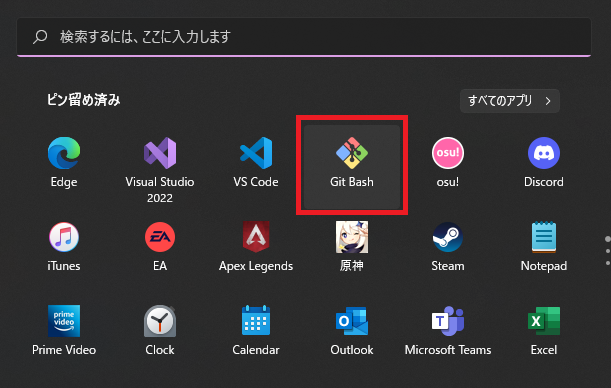
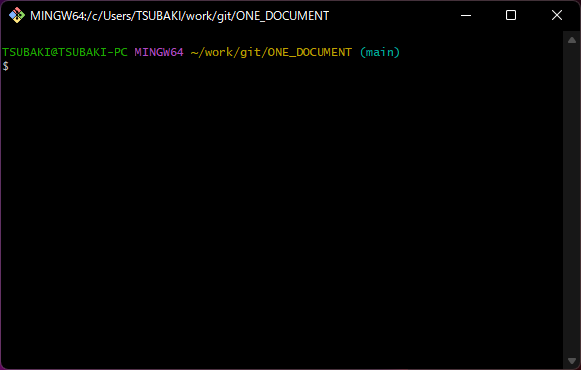
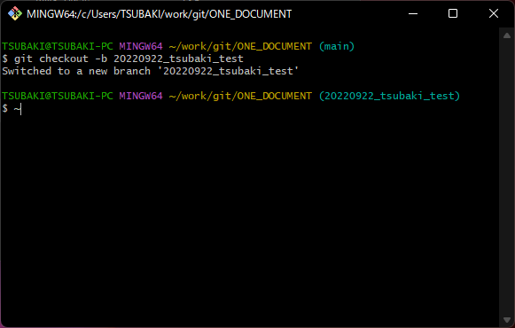
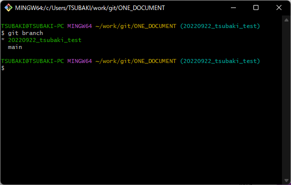
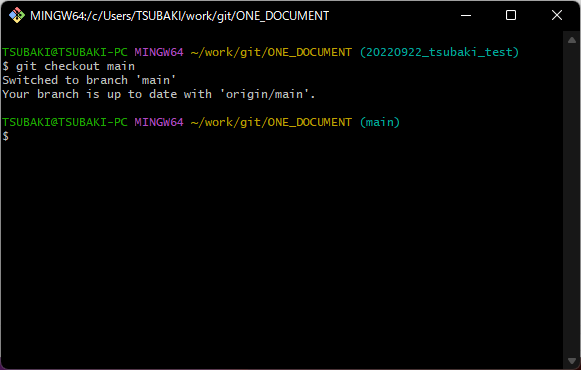
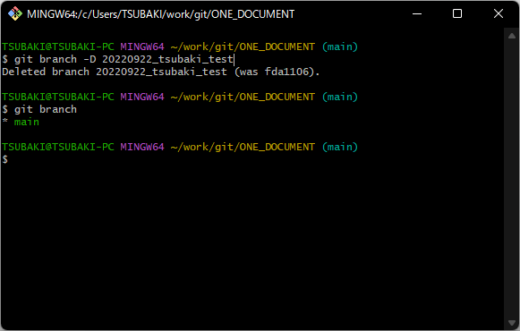

<link href=".\css\StyleSheet.css" rel="stylesheet"/>
 

# branchの作成

1. git Bash を起動しましょう
   
    <br><br>

2. branchを作るリポジトリーへ移動しましょう
userのディレクトリーからであれば以下のコマンドで移動できます。<br>
※今回はONE_DOCUMENTのbranchを作ってみす。<br>

   ```sh
   cd git/ONE_DOCUMENT
   ```
   以下のように`ONE_DOCUMENT`のディレクトリーにいればOK<br>
   ※執筆者の環境では`work/`配下にいるので下記のようになっている。<br>
   併せて`ONE_DOCUMENT`の後ろの`main`にも注目。<br>
   ここには現在いる自分のいる`branch`が表示される。
   

3. `main branch`をベースに新たに`branch`を作ろう。<br>
   以下コマンドで**今いる自分のいるbranch**をベースにbranchを作ることができる。 <br>
   `[branch_name]`の箇所は任意の名前に置き換えよう。
   ### ブランチ命名規則 <br>
   基本的に以下の通り命名をすること<br>
   `yyyymmdd_UserName_BranchName`<br>
   BranchNameは変更点がわかりやすい名前にすること<br>


   ```sh
   git checkout -b [branch_name]
   ```
   以下のように`branch`が作成できると作成した`branch`に切り替わる<br>

   

# branchの確認
4. `branch`の一覧を確認しよう<br>
   `git branch`コマンドで確認できる。
   ```sh
   git branch
   ```
   

# branchの移動
5. `main branch`へ移動してみよう<br>
   `git checkout`コマンドで移動しよう。<br>
   ディレクトリー名の右側が`(main)`になればOK
   ```sh
   git checkout [branch_name]
   ```
   

# branchの削除
6. 作成したbranchを削除してみよう<br>
   ときは `branch -D`コマンドで行える<br>
   `-D`の部分は大文字、小文字で意味が変わるので注意しましょう。
   ```
   git branch -D [branch_name]
   ```
   削除した後に`git branch`を実行して削除されたことも確認
   


7. チュートリアル終了
   
   [チュートリアルに戻る](../Read_Me.md#チュートリアル)
   