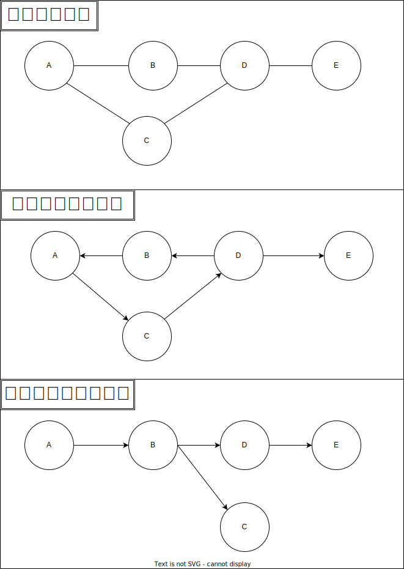

# AirFlowとは
Airflowは、2014年にAirbnb社が開発したオープンソースであり、2016年より Apache財団となる。開発言語は Pythonで、ワークフローエンジンに該当する。

Home
https://airflow.apache.org

ワークフロー管理ツールです。類似のもので言うとdigdagやargoなどが該当します。
Airflowは、予め決められた順序を基に、処理を実行するワークフローをプログラムで作成する。また、スケジュールや監視を行う事が可能。
ワークフローはタスクの有向非巡回グラフ（DAG）を作成する事により、タスクを実行する。
具体的にはpythonでファイルを実装して処理順番を指定していきます。

# DAGとは
DAGとは、Directed acyclic graphの略であって、有向非巡回グラフを指します。方向性があり後戻りをしない特徴があるので、複数に分岐した後で元に戻らなければ良いという特徴があります。 
重要なのは、エッジ(線)のベクトルが有向で、さらに一度通ったノード(点)には戻ってこれないという非巡回性の特性を持つ事である。

# アーキテクチャ
Apache Airflow を理解するために、アーキテクチャを理解していく。
## Apache AirFlow Component
AirFlowには以下のコンポーネントで構成されている。
- Webserver:UI部
     DAG とタスクの動作を検査、トリガー、デバッグするための便利なユーザー インターフェイスを提供する
     

- Scheduler:スケジュール部
     スケジュールされたワークフローのトリガーと、実行するための Executor へのタスクの送信の両方を処理する。
     

- Executer:実行部
     実行中のタスクを処理するエグゼキュータ。デフォルトのAirflowインストールでは、スケジューラ内ですべてを実行しますが、ほとんどの本番環境に適したエグゼキュータは、実際にはタスクの実行をワーカーにプッシュします。
     
- DAG Directory
     SchedulerとExecuter (およびエグゼキューターが持つすべてのワーカー) によって読み取られる DAG ファイルのフォルダー
     

## Apache AirFlow プログラムアーキテクチャ

Airflow のプログラムは以下のように大きく３つに区分される。

- DAG : どのような順序で実行されるかを記述したプログラム
- Operator : プログラムを実行するためのテンプレート
- Task : 実行する処理

Task の定義に Operator が記述されており、Python で処理を実行するための PythonOperator Bash 実行のための BashOperator、他各種 RDBMS や Hive、AWS や GCP など 様々なサービスの APIをコールする Operator が用意されている。
これらを様々なオペレーターを使用することで様々なタスクをスピーディーにくみ上げることができる。

## その他機能
その他 Airflow の機能については以下が存在する。

- Connection：各種データストアへの接続情報を管理
- Hook：Connection を使ってデータストアにアクセスしたり、データをload/dumpするためのメソッド
- Pools：タスクの並列数を管理
- Queue：Celeryのような、外部のキューイングシステムをジョブキューとして利用可能
- Branching：DAG中での条件分岐を実現
- SLA：一定時間内に成功しなかったtaskを管理者にメール通知

# UIの見方
ここではAirflowで使用する主要の2画面について解説します。
## DAGs画面

1. DAGの有効スイッチ 
    DAGスケジュール、DAGトリガーを有効にするスイッチ。クリックで確認なくON、OFFが切り替わるので注意が必要。

2. TAG名
     DAGファイルのparameterでTAG名を設定しておくことでTAG名が表示される。
     TAGの命名ルールを整理しておくとDAGの整理等が行いやすくなる。

3. DAG名
     DAGファイルのパラメターで設定した`dag_id`で設定したIDが表示される。 
    DAGのファイル名ではないので注意が必要。

4. オーナー名
    DAGファイルのparameterでオーナー名を設定して置くことでオーナー名が表示される。複数のチームでAirflowを使用する場合、所有者（チーム）を把握できるようになる。

5. 累積実行結果
     実行結果（累積）が出力される。
6. 実行スケジュール
     DAGファイルのparameterで`Schedule_interval`を設定しておくことで実行周期が表示される。 
    実行周期の表記方法については[cron](https://en.wikipedia.org/wiki/Cron#CRON_expression)表記方法、または[プリセット](https://airflow.apache.org/docs/apache-airflow/1.10.1/scheduler.html)で表記される。
7. 直近のTaskの実行状況
     現在実行しているtaskまたは、直近のtaskの実行結果を確認することができる。
8. DAG操作
     左から`手動実行`・`ステータス更新`・`DAGの物理削除`の操作を行うことができる。

9. DAG名検索
     DAG名入力して複数あるDAGの中から対象のDAGを探すことができる。
10. TAG名検索
     TAG名入力して複数あるDAGの中から対象のDAGを探すことができる。

## DAG詳細画面（Tree View）

1. DAGの有効スイッチ 
    DAGスケジュール、DAGトリガーを有効にするスイッチ。クリックで確認なくON、OFFが切り替わるので注意が必要。

2. DAG名
     DAGファイルのパラメターで設定した`dag_id`で設定したIDが表示される。 
    DAGのファイル名ではないので注意が必要。

3. グラフビュー
    taskの依存関係をグラフ形式で表示することができる。

4. タスクの実行間隔
    タスクの実行間隔を分析する画面に移動
5. タスクの試行時間
    
6. タスクの終了時間
    
7. タスクの実行結果のガントチャート画面

8. DAGの設定値確認画面

9.  DAGを定義しているソースコード

10. taskの実行ステータスについての説明欄
11. Tree Viewで見るtaskの実行結果の抽出期間の設定
12. Tree　Viewで実行結果を確認することができる。

# DAGの作成
AirFlowのDAGを作成するためには`.\opt\airflow\dags`へDAGファイルの置く必要がある。今回は以下のSampleファイルを自身の環境のdagsフォルダーへ格納しよう。 [Sample_DAGファイル](Sample_code/A_simple_tutorial_DAG.py)

ファイルを設置後（30秒後ほど）にAirFlowの画面を更新すると画面上で
DAGが追加されていることが確認できる。 
Treeビューで実際のTree構造とSampleのソースコードを確認しながら記述方法について予習しておくとよいだろう。
※AirFlowの環境構築については[こちら](AirFlow_built_environment.md)

また、DAGの記述Sampleは公式で様々なケースモデルが提供されているので
こちらを参考にすると良いだろう。 
[公式Sample集](https://airflow.apache.org/docs/apache-airflow/2.0.2/_modules/index.html)
