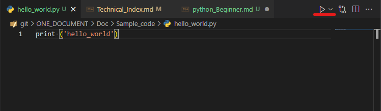
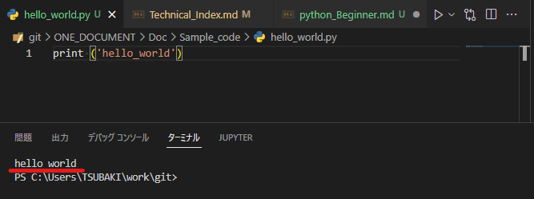

# Python入門編
本書はプログラミング未経験の物がまず学習する点に関して集約して記述する。
本格的に学習を開始する場合、以下を学習の後、参考書を読むことで理解速度が早まるとと思う。

ここでは個々の標準メゾット(関数)については説明しないため標準のメゾット(関数)について不明な場合は、別途検索し学習することを進めます。

pythonのインストール方法は以下のリンクを引用

[Pythonインストール Windows10(64bit)編](https://qiita.com/ssbb/items/b55ca899e0d5ce6ce963)

# 目次
- [Python入門編](#python入門編)
- [目次](#目次)
- [初めに](#初めに)
- [変数と型](#変数と型)
- [演算子](#演算子)
  - [Pythonで使用できる`算術演算子`は以下の9種類。](#pythonで使用できる算術演算子は以下の9種類)
  - [Pythonで使用できる`代入演算子`は以下の13種類。](#pythonで使用できる代入演算子は以下の13種類)
  - [Pythonで使用できる`比較演算子`は以下の10種類。](#pythonで使用できる比較演算子は以下の10種類)
  - [Pythonで使用できる`論理演算子`は以下の3種類。](#pythonで使用できる論理演算子は以下の3種類)
  - [Pythonで使用できる`文字列演算子`は以下の7種類。](#pythonで使用できる文字列演算子は以下の7種類)
- [Moduleを作成してみる](#moduleを作成してみる)
- [簡単な処理を書いて実行してみる](#簡単な処理を書いて実行してみる)
- [関数を作成する。](#関数を作成する)
- [条件によって処理を分岐する](#条件によって処理を分岐する)
- [繰り返し処理をする](#繰り返し処理をする)
- [外部ライブラリーを使用して機能を拡張する](#外部ライブラリーを使用して機能を拡張する)
- [`if __name__ == ‘__main__’` の使い方](#if-__name__--__main__-の使い方)
- [Classを作成する。](#classを作成する)
- [クラス定義を作成する](#クラス定義を作成する)
- [Class継承](#class継承)
- [リファレンスなどの見方(中級者以上の学習方法)](#リファレンスなどの見方中級者以上の学習方法)

# 初めに
pythonは、オランダ人のグルド・ヴァンロッサム氏が開発し1991年に登場した
言語でソースコードの書き方は`オブジェクト指向`、`命令型`、`手続き型`、`関数型`などの形式に対応しているので、状況により使い分けることができます。
ソースコードの特徴として、[インデント](https://e-words.jp/w/%E3%82%A4%E3%83%B3%E3%83%87%E3%83%B3%E3%83%88.html)をする決まりがあるのでコード構造が
わかりやすく、しやすいという点があります。

一般的に開発を行う場合、エディター用いますが、執者は`Visual Studio code`を用いて開発を行っている。

各エディターにはPythonの記述規則違反を自動で検知、または校正する`Linter（リンター）`という機能や、余分な改行や空白を除去、[インデント](https://e-words.jp/w/%E3%82%A4%E3%83%B3%E3%83%87%E3%83%B3%E3%83%88.html)の位置を修正する`Formater(フォーマッター)`また、適切な順序で並べ替えてくれる`Sort`などの機能が
開発ツールには付随していたり、拡張することができるので、まずは学習を開始する前に、導入してから学習することで、正しい記述規則が身につくのでお勧めです。

執者は、`Visual Studio code`で`flake8`という`Linter（リンター）`を
導入しているので設定のリンクを引用

[Visual Studio Code へ flake8 を導入する](https://qiita.com/fehde/items/723b619013dc86008acc)


# 変数と型
プログラミングでよく使われる、`変数`

変数には一時的にデータを格納することができるが、データの形式によって
変数の型は異なるので、まず初めに理解しておくことが必要。

`Python`の主なデータ型は以下

| データ型       |       | 説明                                            | 記述例                                                |
|------------|-------|-----------------------------------------------|----------------------------------------------------|
| str        | 文字列   | 文字、文字列                                        | str = 'abc'                                        |
|            |       | " " ダブルクォーテーション、もしくは' ' シングルクォーテーションで囲って定義する。 |                                                    |
| int        | 整数    | 小数点を含まない数値                                    | num = 6                                            |
| float      | 浮動小数点 | 小数点を含む数値                                      | num = 3.14                                         |
| bool       | ブール   | True、Falseで定義する。                              | check_flg = True <br> check_flg = False                                 |
| datetime   | 日付    | 日付                                            | date1 = datetime.datetime(2020, 1, 31, 12, 36, 45) |
| list       | 配列    | 1.複数の要素（文字列、整数、論理など）を含むもの。<br> 2.[ ] を使って定義し、各要素の間はカンマ','で区切る。<br> 3.格納した各要素の変更が可能。                    | list = ['abc', 6, True] <br> print list[0] (`abc`が出力される。)  |
| tuple      | タプル   | 1.複数の要素（文字列、整数、論理など）を含むもの。 <br>  2.( ) を使って定義し、各要素の間はカンマ','で区切る。 <br> 3.格納した各要素の変更は不可能。                | tuple = ('abc', 6, True)  <br> print tuple[1] (`6`が出力される。)  |
| dictionary | 辞書    | 1.複数の要素（文字列、整数、論理など）を含むもの。 2.{ }を使って定義し、各要素は、キーと組合せて間にコロン':'を挟み記述する。 <br> 3.キー値と合わせて値を設定することにより、キー値を元に値を参照できる。 <br>  4.格納した各要素の変更は可能。| dict = {'Key1' : 'Val1', 'Key2' : 'Val2'} <br> print dict(Key2) (`Val2`が出力される。)         |

# 演算子
プログラミングでは演算子を用いていろいろな判定を行う。
演算子について、基本的な要素なのでまず初めに理解しておくことが必要。
まず、演算子には`算術演算子` `代入演算子` `比較演算子` `理論演算子` `文字列演算子`などがある。
他にも演算子は存在するが、初期の学習に言いてまずは上記を優先的に押さえておくと良いので以下にまとめておきます。

## Pythonで使用できる`算術演算子`は以下の9種類。

| 演算子            | 内容             |
|----------------|----------------|
| +a             |   正数           |
| -a             |  負数            |
| a + b          |    加算          |
| a - b          |    減算          |
| a * b          |    乗算          |
| a / b          |   除算           |
| a % b          |   a を b で割った余り |
| a ** b         |   a の b 乗      |
| a // b         |  切り捨て除算        |


## Pythonで使用できる`代入演算子`は以下の13種類。

| 演算子            | 内容              |
|----------------|-----------------|
| a = b          |  a に b を代入する    |
| a += b         |  a = a + b に同じ  |
| a -= b         |  a = a - b に同じ  |
| a *= b         |  a = a * b に同じ  |
| a /= b         |  a = a / b に同じ  |
| a %= b         |  a = a % b に同じ  |
| a **= b        |  a = a ** b に同じ |
| a //= b        |  a = a // b に同じ |
| a &= b         |  a = a & b に同じ  |
| a |= b         |  a = a | b に同じ  |
| a ^= b         |  a = a ^ b に同じ  |
| a <<= b        |  a = a << b に同じ |
| a >>= b        |  a = a >> b に同じ |

## Pythonで使用できる`比較演算子`は以下の10種類。

| 演算子               | 内容                                        |
|-------------------|-------------------------------------------|
| a == b            | a が b と等しい                                |
| a != b            | a が b と異なる                                |
| a < b             | a が b よりも小さい                              |
| a > b             | a が b よりも大きい                              |
| a <= b            | a が b 以下である                               |
| a >= b            | a が b 以上である                               |
| a is b            | a が b と等しい                                |
| a is not b        | a が b と異なる                                |
| a in b            | a が b に含まれる (a, b は共に文字列、または、b はリストやタプル)  |
| a not in b        | a が b に含まれない (a, b は共に文字列、または、b はリストやタプル) |

## Pythonで使用できる`論理演算子`は以下の3種類。

| 演算子     | 内容              |
|---------|-----------------|
| a and b | a も b も真であれば真   |
| a or b  | a または b が真であれば真 |
| not a   | a が偽であれば真       |

## Pythonで使用できる`文字列演算子`は以下の7種類。

| 演算子            | 内容                                        |
|----------------|-------------------------------------------|
| a + b          | 文字列 a と 文字列 b を連結します                      |
| a * n          | 文字列 a を n 回繰り返します                         |
| a[n]           | 文字列 a の中の n 番目の文字を取り出します                  |
| a[n:m]         | 文字列 a の中の n 番目から m 番目までの文字列を取り出します        |
| a[n:]          | 文字列 a の中の n 番目から最後までの文字列を取り出します           |
| a[:m]          | 文字列 a の中の 0 番目から m 番目までの文字列を取り出します        |
| a[n:m:s]       | 文字列 a の中の n 番目から m 番目までの文字列を s個とばしで取り出します |

# Moduleを作成してみる
まずは任意のディレクトリーに`py`拡張子のファイルを作成して`hello_world`と表示される`Module`を作成してみる。
`print`メゾットはコンソールに値を出力することができるメゾット

```py
print ('hello_world')
```

[Sample_Code](./Sample_code/hello_world.py)

作成したModuleを実行するには画像右上の再生マークから実行できる。


<br>
実行すると`hello_world`と実行される。



# 簡単な処理を書いて実行してみる
では簡単な処理を書いてみましょう。
今回は、直径25cmの円の面積を求めましょう。

以下では`math`というPython標準のライブラリーから
円周率`math.pi`を取得し`πr²`を計算してプリントしています。
ライブラリーの使い方は[ここから](#外部ライブラリーを使用して機能を拡張する)

>ポイント：プリントするときに単位を一緒に出力するために計算した値を文字列に変換しています。
　計算した結果は`float`型で単位は'str'型なので型を合わせないと文字を結合できないため。

```py
import math

R: int = 25

range: str = 'cm'

print(str((math.pi*R)**2) + range)

```

[Sample_Code](./Sample_code/easy_calculation.py)


# 関数を作成する。
次に簡単な関数を作成してみましょう。
関数とはインプットされた値をもとに、決められた処理を実行してくれるプログラムの部品です。
今回は前回の練習にそって円の面積をお求める関数を作ります。

`def`[ステートメント](https://e-words.jp/w/%E3%82%B9%E3%83%86%E3%83%BC%E3%83%88%E3%83%A1%E3%83%B3%E3%83%88.html)とは`python`で関数を定義する際、関数名の前方に記述する（def文）宣言です。

以下の例では`circle_Area`という関数を定義して、半径と、単位を引数として関数に渡すだけで
円の面積を求められる関数を作った。

関数を使用することで、複雑な処理をまとめることができ、何度も似たような処理を記述しなくて済む。
また、単体テストなども容易になり、開発速度も早くなる。

>ポイント1：def文で定義す箇所は[インデント](https://e-words.jp/w/%E3%82%A4%E3%83%B3%E3%83%87%E3%83%B3%E3%83%88.html)を入れて記述します。

>ポイント2：関数はソースコードの初めに定義しましょう。最後に定義すると`print`メゾット内で呼び出している関数が動かない。

```py
import math

r: int
ren: str


def circle_Area(R: int, range: str):

    return str((math.pi*R)**2) + range


r = 25
ren = 'cm'
print(circle_Area(r, ren))

r = 10
ren = 'mm'
print(circle_Area(r, ren))

```

[Sample_Code](./Sample_code/easy_function.py)

# 条件によって処理を分岐する
プログラミングにおいてとても重要な要素条件分岐について
プラクティスをしようと思う。
条件分岐は`if`[ステートメント](https://e-words.jp/w/%E3%82%B9%E3%83%86%E3%83%BC%E3%83%88%E3%83%A1%E3%83%B3%E3%83%88.html)で行うことができる。

if[ステートメント](https://e-words.jp/w/%E3%82%B9%E3%83%86%E3%83%BC%E3%83%88%E3%83%A1%E3%83%B3%E3%83%88.html)では[比較演算子](#pythonで使用できる比較演算子は以下の10種類)と[理論演算子](#pythonで使用できる論理演算子は以下の3種類)
条件にマッチしているか判定し、その判定に基づき処理を変えるというものです。

以下の例では前回[関数を作成する](#関数を作成する)で作成したソースコードに条件分岐を追加し関数の引数に渡された値によって出力される値が変わるようになっている。

>ポイント1:`if`[ステートメント](https://e-words.jp/w/%E3%82%B9%E3%83%86%E3%83%BC%E3%83%88%E3%83%A1%E3%83%B3%E3%83%88.html)の処理は[インデント](https://e-words.jp/w/%E3%82%A4%E3%83%B3%E3%83%87%E3%83%B3%E3%83%88.html)を入れて記述する。

>ポイント2:[ステートメント](https://e-words.jp/w/%E3%82%B9%E3%83%86%E3%83%BC%E3%83%88%E3%83%A1%E3%83%B3%E3%83%88.html)の終わりで[インデント](https://e-words.jp/w/%E3%82%A4%E3%83%B3%E3%83%87%E3%83%B3%E3%83%88.html)を戻すことを忘れないように。

```py
import math

r: int
ren: str


def circle_Area(R: int, range: str):
    result: str

    if R > 10:
        print('計算失敗')
        result = '入力された値が小さすぎて計算できません。' \
            + '\n入力された値:' \
            + str(R) + '\n10より大きい数を入力してください。'

    else:
        print('計算成功')
        result = str((math.pi*R)**2) + range

    return result


r = 25
ren = 'cm'
print(circle_Area(r, ren))

r = 10
ren = 'mm'
print(circle_Area(r, ren))

```

[Sample_Code](./Sample_code/easy_if.py)

# 繰り返し処理をする
# 外部ライブラリーを使用して機能を拡張する
# `if __name__ == ‘__main__’` の使い方
# Classを作成する。
# クラス定義を作成する
# Class継承
# リファレンスなどの見方(中級者以上の学習方法)
