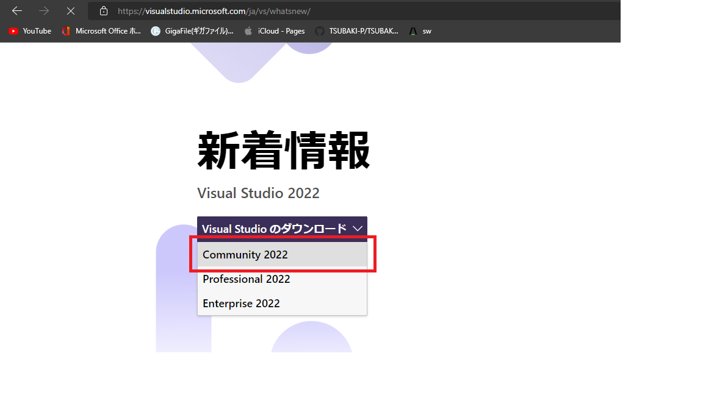
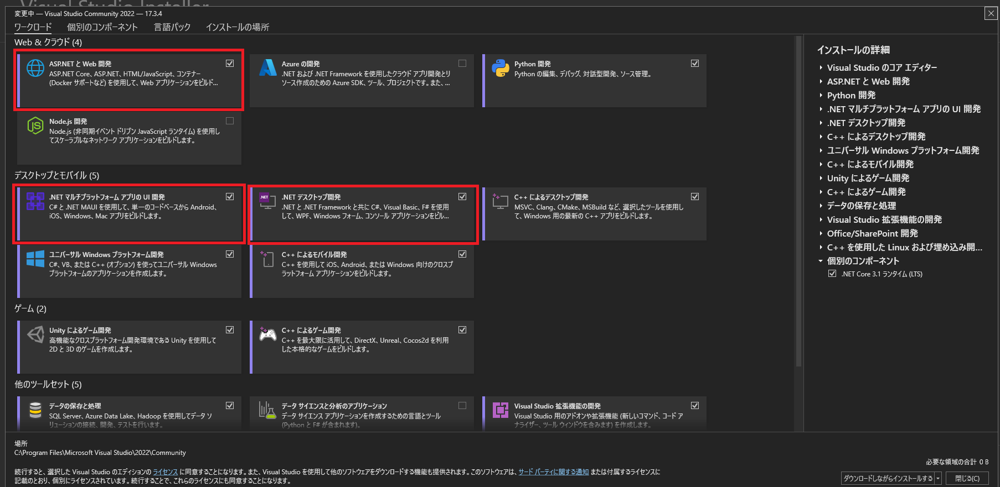

# Read Me

チームに新たに参加した方は必ず目を通しておいてください。

 

## リポジトリールール
---
### ブランチについて
基本的に`main`ブランチは`Push`禁止です。
無料枠の中で管理している関係上mainブランチに`Push`できてしまうため注意してください。

万が一`Push`してしまった場合にはチームディスカッションで報告をお願いします。こちらで復元を行います。

### ブランチ命名規則
基本的に以下の通り命名をすること
`yyyymmdd_UserName_BranchName`
BranchNameは変更点がわかりやすい名前にすること

### 開発進行について
開発進捗についてはプロジェクトのタスクスレッドで共有すること。 
ソースレビューを依頼したい場合には、対象の`branch`を`Push`したあとPRでDraftを発行しメンションをつけて共有すること。

### 開発環境について
visual studio 2022で進めていいます。
※古いバージョンだとサポートされていない可能性があるので注意してください。

 

## 環境準備
---
### Visual_Sudio_2022のインストールについて
- [ダウンロードリンク](https://visualstudio.microsoft.com/ja/vs/whatsnew/)

(
- [インストール手順](https://learn.microsoft.com/ja-jp/visualstudio/install/install-visual-studio?view=vs-2022)

- インストールコンポーネント　※個別のComponentはデフォルトでOK
  

### Gitについて
 Gitは学習と慣れのためにGitBashを使用しましょう

- [ダウンロードリンク](https://gitforwindows.org/)
- [インストール手順](https://qiita.com/suke_masa/items/404f06309bb32ca6c9c5)
- [GitBashの使い方](https://www.granfairs.com/blog/staff/gitbash-setting-shortcut)

### レポジトリークローンを作成しましょう。

